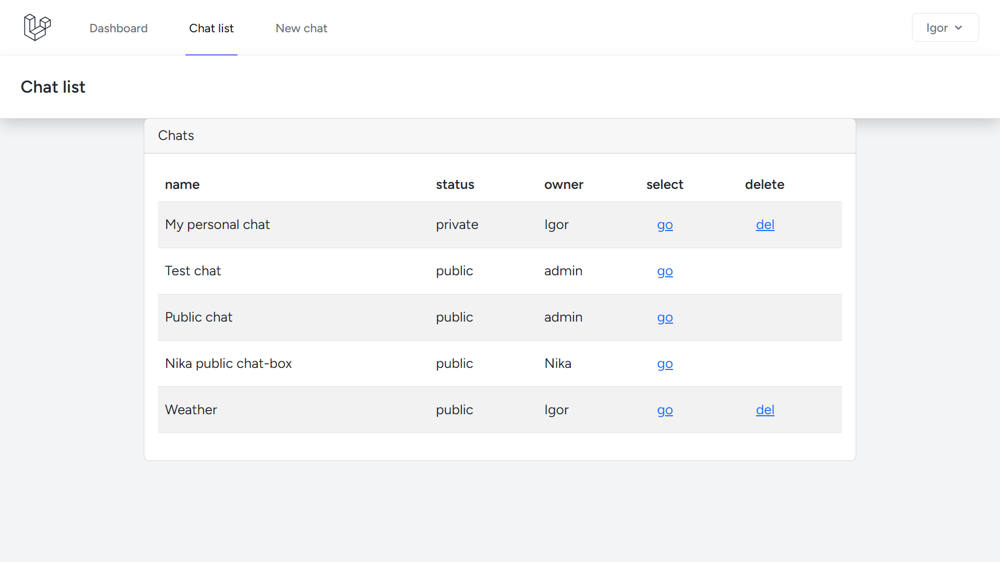
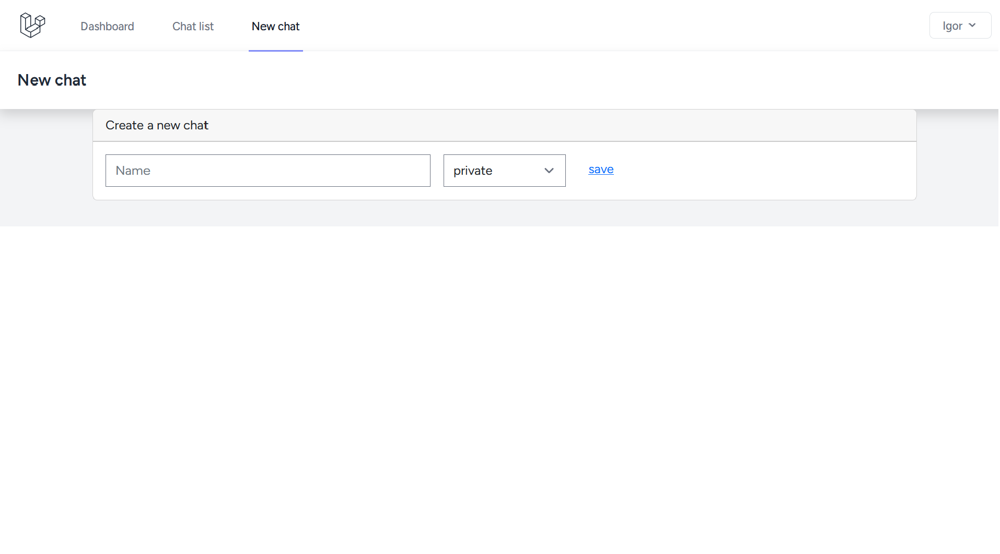
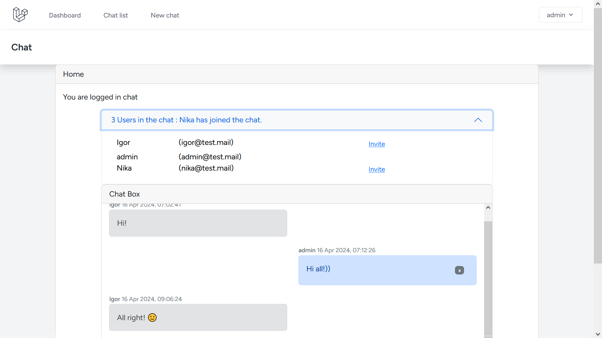
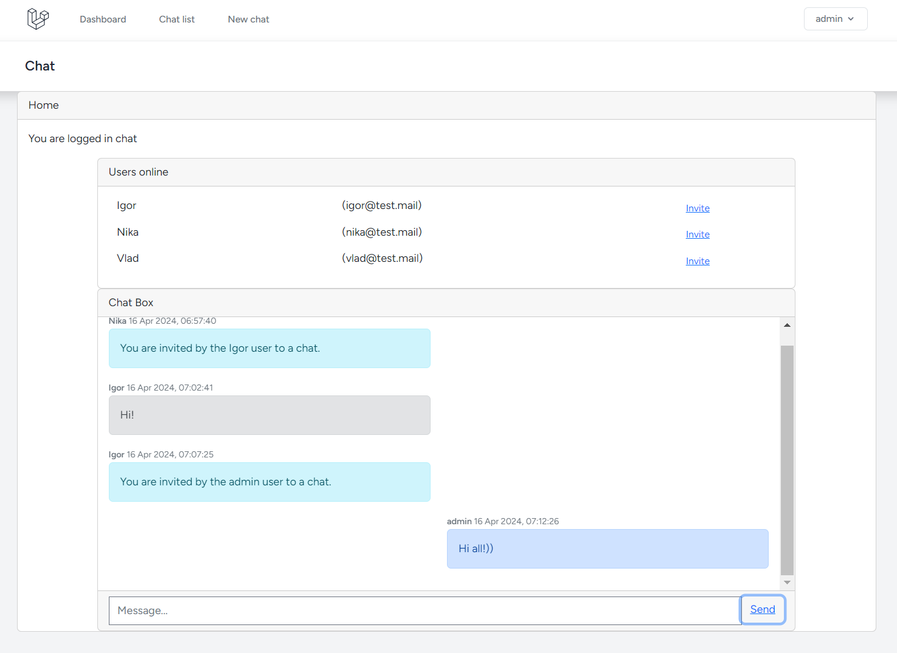

<p align="center"><a href="https://laravel.com" target="_blank"></a></p>


## Laravel 11 Live Chat, React SPA with Pusher.


Commands init application:

```
> cd /path_to_projects
> git clone https://github.com/Igor-ad/laravel_live-chat.git
> cd /path_to_projects/laravel_live-chat
> cp ./.env.example ./.env

```

It is necessary to fill in the parameters of the environment file ./.env with the following values:
DB_PASSWORD
PUSHER_APP_ID,
PUSHER_APP_KEY,
PUSHER_APP_SECRET,

```
> composer install
> chmod 777 -R ./storage/logs
> chmod 777 ./storage/framework/views
> php artisan key:generate
> php artisan migrate
> npm install 
> npm run build
> php artisan queue:listen

```

##### Examples of web pages





